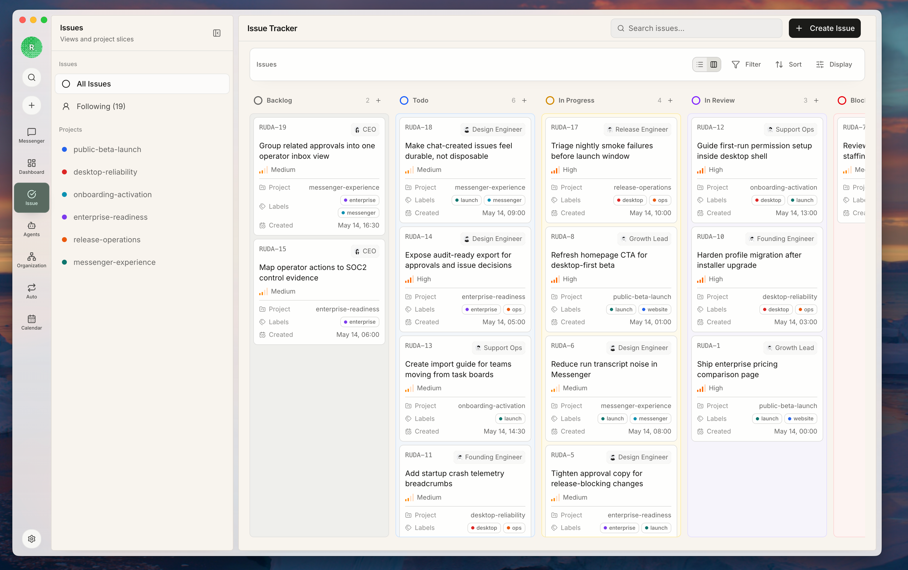
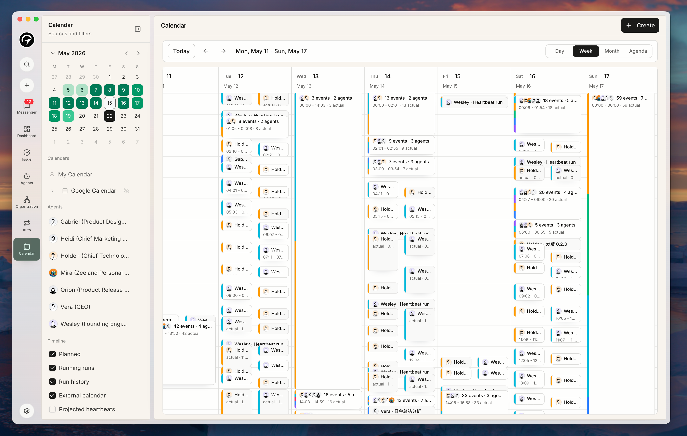
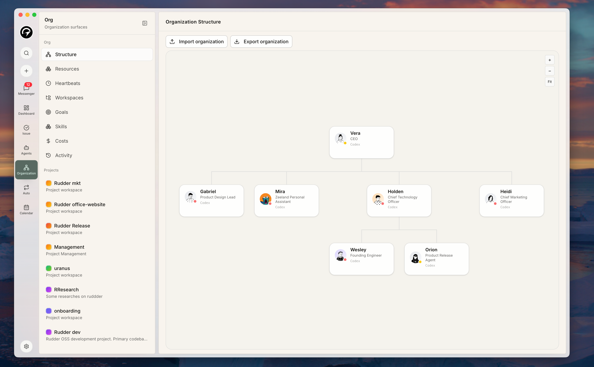
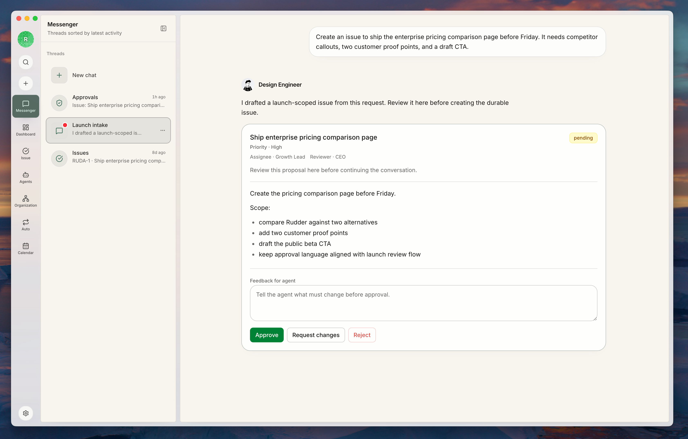
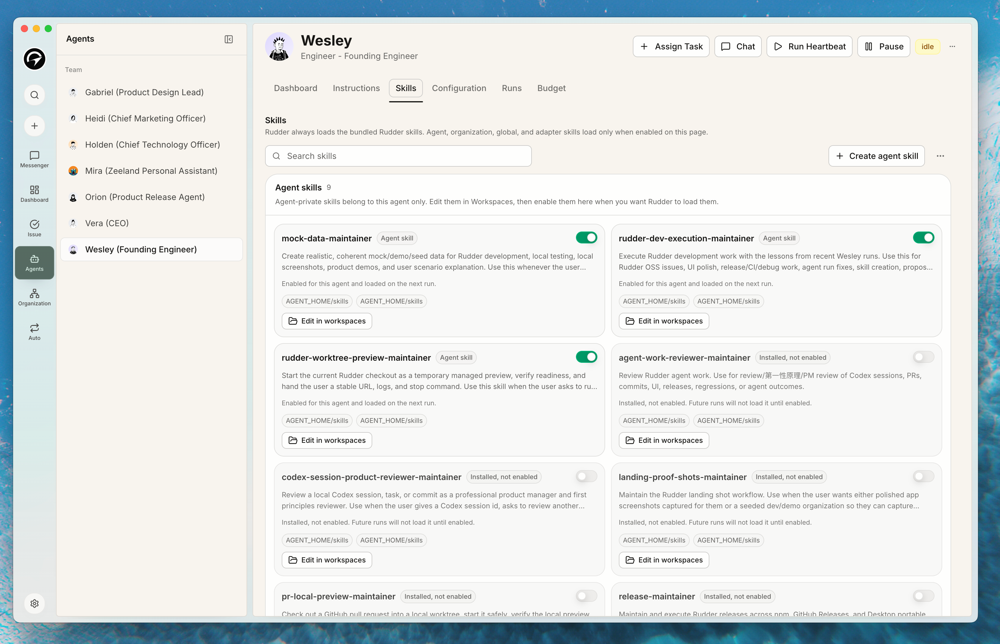
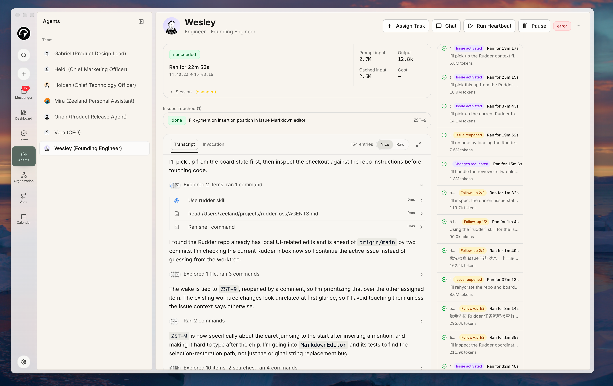
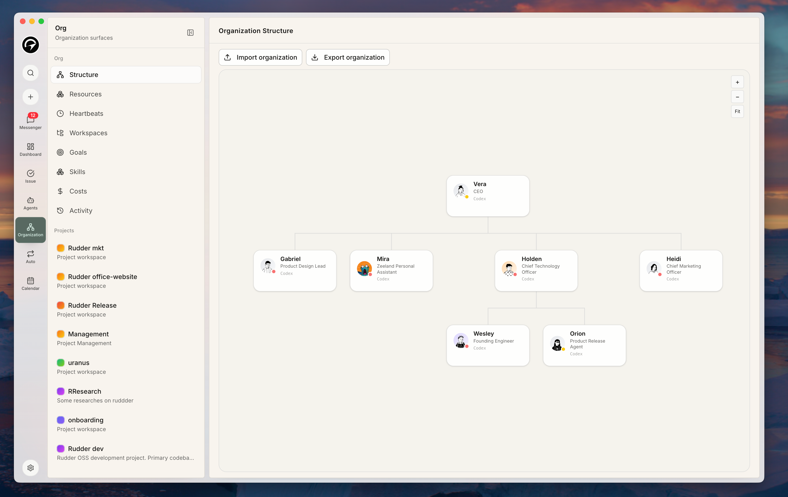

# Rudder

> Build your self-improving Agent Team.

Agents that think, build, play, and learn from real work.

Rudder turns goals, issues, agent runs, reviews, and feedback into a work loop for agent teams. It gives humans and agents a shared operating structure for assigning work, running agents, reviewing outputs, controlling spend, and preserving the lessons that should make the next run better.

Rudder began as a fork of an early version of Paperclip. That gave the project a practical starting point for agent operations; Rudder is now evolving around a sharper product idea: agent teams improve when real work leaves behind durable context, decisions, feedback, and reusable operating patterns.

Rudder is built for the moment when agent work stops looking like a single prompt and starts looking like a real team.

## The Work Loop

Rudder is designed around the loop that makes agent work compound:

```text
Goal -> Issue -> Agent run -> Review -> Feedback -> Learning -> Better future runs
```

The control plane matters because this loop needs structure. Goals explain why work exists. Issues make work durable. Heartbeats run agents in a visible way. Reviews and approvals keep autonomy governable. Feedback, comments, documents, run history, and skills give the team a place to keep what it learned.

Rudder does not assume every lesson is automatically promoted into a new skill or workflow. The product direction is to make those promotion paths explicit, reviewable, and reusable instead of leaving them buried in chat transcripts or one-off prompts.

## The Design Idea

The most useful way to work with agents is closer to the way humans coordinate with each other.

People do not operate through one giant shared prompt. They work through shared goals, explicit roles, durable work objects, context attached to the task, clear handoffs, and escalation paths when judgment or approval is needed. Teams also need visibility: what is moving, what is blocked, what it costs, and where intervention matters.

Rudder turns those coordination patterns into product primitives for agent teams:


















- work belongs to an organization, not a loose thread
- every issue should trace back to a goal
- agents have roles, runtime config, reporting lines, and skills
- chat helps clarify and route work, while durable execution stays attached to issues, approvals, outputs, and run history
- autonomy stays legible, governable, and budget-aware

## What Rudder Is

Rudder is the operating layer for self-improving agent teams. One Rudder instance can run one or many organizations, each with its own goal, org structure, agents, issues, budgets, approvals, feedback, and governance.

| Human team pattern | Rudder equivalent |
| --- | --- |
| Mission | Organization goal |
| Employees | AI agents |
| Org chart | Agent reporting structure |
| Work ownership | Issues and assignments |
| Team workflow | Workflow definitions and execution paths |
| Operational memory | Comments, documents, run history, activity, and skills |
| Manager check-ins | Agent heartbeats |
| Executive review | Board approvals |
| Budget discipline | Spend tracking and hard stops |

Rudder coordinates agents. It does not force one runtime, one model, one prompt format, or one execution environment.

## Get Started

### Try Rudder

The fastest path installs the per-user portable Rudder Desktop app and prepares the matching persistent CLI:

```bash
npx @rudderhq/cli@latest start
```

After the persistent CLI is available, the direct `rudder` form is the same command surface:

```bash
rudder start
```

### Develop Rudder

For contributors working on the repo itself:

```bash
git clone https://github.com/Undertone0809/rudder
pnpm install
pnpm dev
```

This starts the API server and UI at [http://localhost:3100](http://localhost:3100).

Rudder defaults to embedded PostgreSQL in development. If `DATABASE_URL` is unset, you do not need to provision a separate database.

## A Typical Rudder Flow

1. Create an organization.
2. Define the organization goal.
3. Create or use a default agent with a clear role and runtime.
4. Add more agents only when repeated work needs stable ownership.
5. Create or convert work into issues.
6. Let agents pick up work through heartbeat invocations.
7. Review outputs, approvals, activity, and spend from the board.
8. Leave feedback on the run, issue, or output.
9. Preserve reusable lessons as better context, skills, decisions, or workflows.
10. Future runs use the improved team context.

Every durable piece of work should still answer one question: why does this issue exist? In Rudder, the intended answer is traceable all the way back to the organization goal.

## Contributing

Small, focused pull requests are easiest to review and merge. For larger changes, start with a discussion or clearly scoped issue before implementation.

Before handing off work, contributors are expected to run the relevant validation for the area they touched. The standard repo-wide baseline is:

```bash
pnpm -r typecheck
pnpm test:run
pnpm build
```

If you touched desktop startup, packaging, migrations, or local profile routing, also run:

```bash
pnpm desktop:verify
```

## License

Rudder is licensed at the project level under Apache-2.0. See [LICENSE](LICENSE), [NOTICE](NOTICE),
