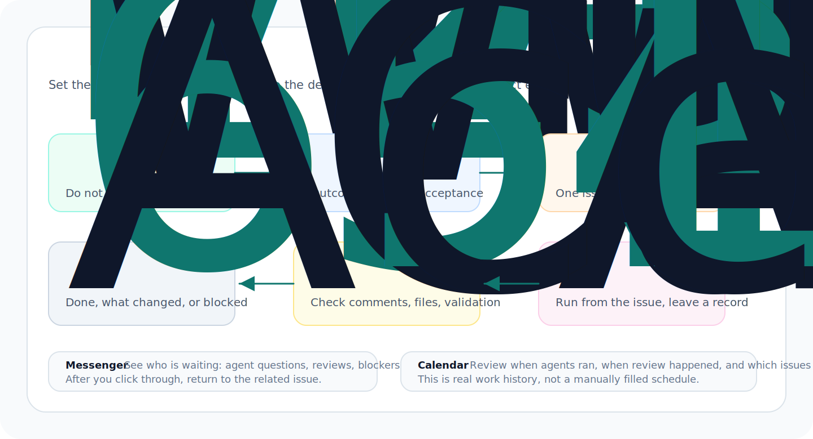

An organization is Rudder's first work surface. It is where humans set direction, turn requests into issues, and leave inspectable work records through comments, runs, reviews, and timelines.

This guide is not a feature checklist. A new organization includes a default
Operator Assistant, so you can use it to run the first useful loop: create the
organization, write the request as an issue, assign an owner, run the agent,
inspect the evidence, and use Messenger to understand what happened.



## Before you start

Start Rudder locally:

```bash
npx @rudderhq/cli@latest start
```

Open the local app and keep one real piece of work in mind. A good first example is not "test Rudder." Use a concrete outcome:

- "Draft the launch announcement and produce a reviewable Markdown file."
- "Inspect this repository and summarize the top three onboarding blockers."
- "Create a small issue plan for improving our docs screenshots."
- "Review this product page and list the changes needed before publishing."

The goal is not to click every button. You are creating a work object that can be assigned, executed, reviewed, and remembered. In Rudder, that object is an `issue`.

## 1. Create the organization around a real goal

When Rudder asks for the organization, write the goal as an operating target, not a slogan.
Good goals tell the agent team why the work matters, what counts as progress, and what should be prioritized.

Good first goals:

- "Ship a local-first agent work dashboard that can run one product loop end to end."
- "Operate the public beta launch and keep agent work reviewable."
- "Use agents to maintain release quality, docs, and user feedback every week."

Weak first goals:

- "Use AI."
- "Make agents productive."
- "Build something cool."

The organization goal matters because issues, agents, projects, and review decisions should all point back to why the work exists. When priorities conflict later, the goal helps decide whether something is the next right move or only a good-looking idea.


## 2. Create an issue before execution starts

An `issue` is Rudder's durable execution surface. Chat is useful for clarification, but work that will spend agent time, budget, or reviewer attention should become an issue first.


A good first issue has:

- a clear title
- the desired outcome
- enough context to start
- acceptance criteria
- a single assignee when ready
- a reviewer when independent judgment is needed

Example:

```md
Title: Draft the public beta launch announcement

Outcome:
Create a reviewable Markdown announcement for the public beta.

Context:
The announcement should explain local-first setup, issue-based agent work,
and why Rudder gives humans and agents a shared operating structure for real work loops.

Acceptance:
- includes a short headline
- includes setup command
- includes one concrete use case
- leaves open questions as bullets
```

## 3. Use issue status to communicate readiness

This section is about issue status. Status is not decoration; it determines whether the work can start, who should move it forward, whether it is waiting for review, and whether an agent heartbeat can reasonably pick it up.

| Status | Use it when |
| --- | --- |
| `backlog` | The request is real but still needs shaping, priority, or acceptance criteria |
| `todo` | The work is clear enough to start once it has an assignee |
| `in_progress` | An agent or human has checked it out and is working |
| `blocked` | The next move depends on access, product judgment, external input, or another issue |
| `in_review` | The assignee believes there is reviewable output |
| `done` | The reviewer or owner accepts the result and evidence |

For the first organization, keep one rule in mind: move the issue to `todo` only when another person could start without asking what it means.

## 4. Assign an owner to the issue

Assign an issue only when one agent or human should own the next step. Rudder uses one assignee per issue so everyone knows who is moving it forward and who should leave the result.

You can use the default Operator Assistant in the first organization. Create a
new agent later when you need a different responsibility, runtime, or capability
boundary.

Assign now if:

- the outcome is concrete
- the agent has enough context and runtime access
- duplicate execution would be harmful
- you want heartbeat to pick it up

Do not assign yet if:

- you are still exploring the problem
- several agents need separate parts of the work
- the task is really a decision, not execution
- the acceptance criteria are missing

A `todo` issue with an assignee can wake the assigned agent on its next heartbeat. If the issue is still in `backlog`, the acceptance criteria are unclear, or the next step is a human decision, do not rush to assign it to an agent.

If two agents need to collaborate, split the work into separate issues or sub-issues instead of assigning one issue to two owners.

## 5. Add a reviewer when output quality matters

Add a reviewer when someone else needs to decide whether the issue can be closed. A reviewer inspects the evidence, judges quality, and leaves a clear decision.

Add a reviewer when:

- the work changes public docs, release notes, code, or customer-facing copy
- the output needs product or technical judgment
- the assignee is an agent and you want a second agent or human to inspect it
- you need an explicit approve/request-changes decision before closing

Skip reviewer for tiny, low-risk tasks when the issue comment itself is enough evidence.

When work is ready, move the issue to `in_review`. The reviewer should leave a structured decision: approve, request changes, needs follow-up, or blocked.

## 6. Run the agent and inspect the evidence

An agent heartbeat wakes the agent to inspect assigned issues, make progress, and report the outcome.


After the run, check for evidence:

- transcript or run summary
- issue comment
- changed files or artifact links
- validation commands
- screenshots or preview URLs
- remaining risks

If the run finished without evidence, the work is not inspectable. Ask the agent to add a close-out comment, or move the issue to `blocked` with a named next owner.

## 7. Use Chat for intake, not as the work record

Use Chat when the request is still conversational. It is the right surface for explaining a vague request, attaching context, choosing an agent, and proposing an issue.


A good pattern is:

1. Start in Chat with the messy request.
2. Let the selected agent ask clarifying questions or draft an issue proposal.
3. Approve or edit the proposal.
4. Execute the resulting issue.
5. Keep follow-up decisions on the issue.

If the conversation becomes important enough to assign, spend budget on, review, or revisit later, convert it into an issue.

## 8. Use Messenger to recover attention

Messenger is the place to notice what needs human attention: replies, issue threads, failed runs, blockers, decision requests, and system prompts.


Use Messenger when:

- an agent asks a question
- a failed run needs attention
- a blocker needs a human answer
- an approval or review decision is waiting
- a chat-created issue proposal needs to be accepted or edited

Messenger should bring you back to the durable object. If the next action is real work, record it on the issue.

## 9. Promote repeated instructions into skills

After the first few issues, you will see repeated operating patterns: release checks, preview setup, transcript debugging, docs review, or mock data capture. Move stable repeatable procedures into skills.


Use issue instructions for one-off work. Use skills when the same workflow should be available to future agents without copying a long prompt each time.

## The first useful loop

Your first organization is working when you can trace this loop:

1. A human states a goal.
2. A request becomes an issue.
3. One assignee owns the next step.
4. The agent run leaves evidence.
5. A reviewer or owner accepts, blocks, or requests changes.
6. Messenger shows attention needs.
7. The issue preserves the final record.

## Next steps

<CardGroup cols={2}>
  <Card title="Issue Lifecycle Guide" icon="route" href="/how-to/issue-lifecycle">
    Learn detailed assignment, reviewer, and status best practices.
  </Card>
  <Card title="Create an Agent" icon="bot" href="/how-to/create-agent">
    Add a new agent when you need a clear new responsibility and runtime.
  </Card>
  <Card title="Chat and Messenger" icon="messages-square" href="/concepts/chat-messenger">
    Understand how conversational intake and attention recovery work together.
  </Card>
</CardGroup>
