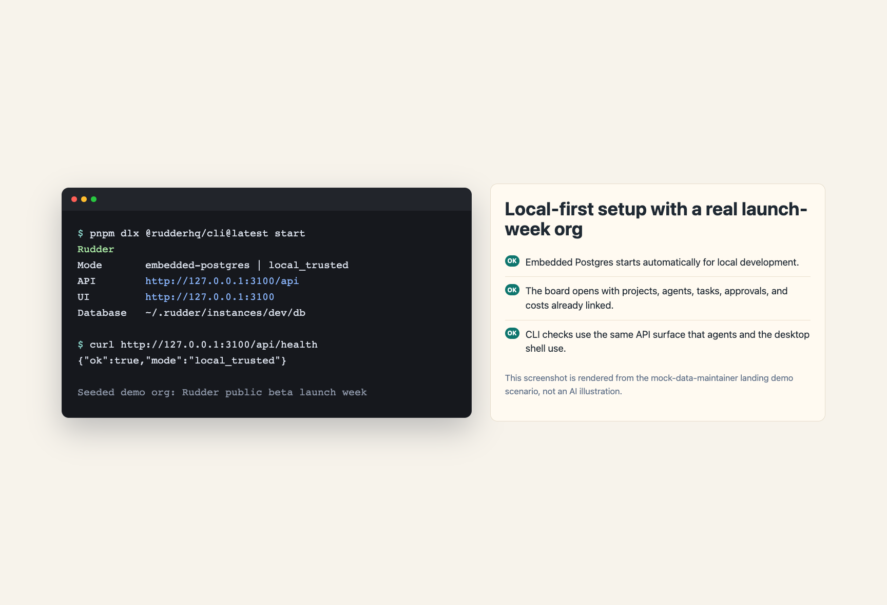

The fastest path installs the per-user portable Rudder Desktop app and prepares the matching persistent CLI. This is the recommended setup when you want a local AI agent work app that can create organizations, assign issues, run agents, and keep review evidence on your machine.

## What does the install command do?

`npx @rudderhq/cli@latest start` starts Rudder's public local setup flow. It prepares the Rudder CLI, opens the portable Desktop app, and keeps the installed app aligned with the selected release channel.



Run the public install command:

```bash
npx @rudderhq/cli@latest start
```

After the persistent CLI is available, the direct `rudder` form uses the same command surface.

```bash
rudder start
```

Use this path when your goal is to open the local app, create an organization,
and run agent work. The command keeps the CLI and portable Desktop app aligned
with the selected release.

## Contributor setup

Use the repository workflow when you are developing Rudder itself.

```bash
git clone https://github.com/Undertone0809/rudder
cd rudder
pnpm install
pnpm dev
```

This starts the API server and UI at `http://localhost:3100`.

Rudder defaults to embedded PostgreSQL in development. If `DATABASE_URL` is unset, no separate database is required.

Use this path only when you are changing Rudder source code. It starts the local
development server and does not install the public portable Desktop app.

## Next steps

<CardGroup cols={1}>
  <Card title="Create Your First Organization" icon="building-2" href="/get-started/first-organization">
    Set up a goal, agents, issues, and review evidence.
  </Card>
</CardGroup>
