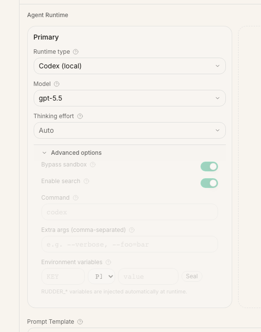
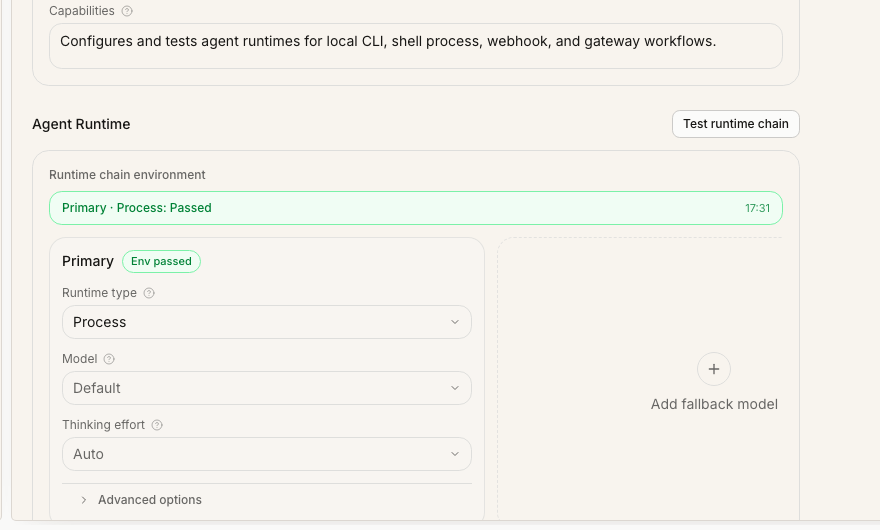

An agent runtime is the execution backend Rudder calls when an agent wakes up. Rudder owns the organization, issue, heartbeat, transcript, and close-out evidence. The runtime owns the actual work: running a local CLI, launching a custom process, calling an HTTP endpoint, or forwarding the run to a gateway.

## Which agent runtimes does Rudder support?

Rudder can run local CLI-backed agents such as Codex and Claude Code, custom shell process runtimes, HTTP webhook runtimes, and gateway-backed runtimes. Choose a local CLI runtime when the agent needs to work in repositories on the Rudder host. Choose Shell Process, HTTP Webhook, or OpenClaw Gateway when you already have a custom runner or external agent service.

Use this guide when you are hiring a new agent, switching an existing agent to a different backend, or wiring Rudder to your own runtime wrapper.

## Before you start

Make sure you have:

- a running Rudder instance
- an organization where you can create or edit agents
- the local CLI, script, gateway, or webhook you want Rudder to invoke
- credentials already installed on the same host that runs Rudder

For local development, start Rudder with:

```sh
npx @rudderhq/cli@latest start
```

Then open the organization, create or edit an agent, and use the Runtime section of the agent form.

## What runtime configuration controls

There are three related pieces of configuration:

| Field | What it controls | Example |
| --- | --- | --- |
| `agentRuntimeType` | Which backend Rudder invokes for heartbeats | `codex_local`, `claude_local`, `process`, `http` |
| `agentRuntimeConfig` | Backend-specific settings | model, instructions file, command, URL, headers |
| `runtimeConfig` | Rudder scheduling and workspace behavior | heartbeat cadence, budgets, workspace settings |

Most runtime setup lives in `agentRuntimeConfig`. Change `runtimeConfig` only when you are configuring how Rudder schedules or hosts the agent, not which executable or endpoint runs the work.

## Choose a runtime

| Runtime | Use it when | Required setup |
| --- | --- | --- |
| Codex (local) | The agent should work in local repositories through Codex | Codex installed and authenticated on the Rudder host |
| Claude Code (local) | The agent should use Claude Code for local operator or repo work | Claude Code installed and authenticated on the Rudder host |
| Gemini, OpenCode, Pi, or Cursor local | You want one of those local CLI-backed agents | The matching CLI installed and authenticated |
| Shell Process | You have a custom script, wrapper, or internal runner | An executable command and optional arguments |
| HTTP Webhook | Your runtime is an external service | A reachable `http://` or `https://` endpoint |
| OpenClaw Gateway | You run agents through an OpenClaw gateway | A reachable gateway URL and any required token/session settings |

Prefer a local CLI runtime when the agent needs a familiar coding-agent environment. Prefer Shell Process or HTTP Webhook when you want Rudder to call your own runtime contract.

## Configure a local CLI runtime

Use a local CLI runtime for Codex, Claude Code, Gemini CLI, OpenCode, Pi, or Cursor-backed agents.



1. Create or edit an agent.
2. Choose the runtime type.
3. Select a model when the runtime exposes model selection.
4. Add an agent instructions file if this agent needs a role-specific markdown file.
5. Configure runtime-specific options.
6. Run the environment test.
7. Assign the agent a low-risk issue and run one heartbeat.

The instructions file should be an absolute path, for example:

```text
/Users/alice/work/rudder-agents/SOUL.md
```

Rudder injects its shared operating contract separately. For Codex, repository-scoped `AGENTS.md` files may still be applied by Codex itself when the agent works inside that repository.

### Use a custom provider/model

Some local runtimes use provider-qualified model IDs. Pi and OpenCode require a model in `provider/model` format. The model picker shows discovered models when the CLI can list them, but discovery is only a suggestion list. If your provider is configured locally and the model does not appear yet, enter the ID directly and run the environment test.

Examples:

```text
opencode/deepseek-v4-flash-free
kimi-coding/kimi-for-coding
deepseek/deepseek-chat
```

For Pi, verify local provider setup with:

```sh
pi --list-models
```

For OpenCode, verify local provider setup with:

```sh
opencode models
```

If discovery returns no models but the custom model is valid for your local provider configuration, keep the custom `provider/model` value and use **Test now**. The test runs the runtime CLI with that model and reports the real provider error if credentials, provider name, or model name are wrong.

Codex-specific options include web search and sandbox bypass. Enable search only when the agent should use web results during runs. Enable sandbox bypass only for trusted local work that needs broader filesystem or network access.

Claude Code options include Chrome access, permission behavior, and max turns per run. Keep these tight for routine work; loosen them only when the agent needs that capability.

## Configure a shell process runtime

Use Shell Process when you already have a script or wrapper that can run one agent work cycle.

In the agent form, set:

| Setting | Meaning |
| --- | --- |
| `command` | Executable to launch, such as `node`, `python`, or an absolute binary path |
| `args` | Arguments passed to the command |
| `cwd` | Working directory for the process |
| `timeoutSec` | Optional run timeout in seconds |
| `graceSec` | Optional shutdown grace period |
| `env` | Optional string environment variables passed to the process |

Example configuration:

```json
{
  "command": "node",
  "args": ["scripts/my-agent-runtime.js"],
  "cwd": "/Users/alice/work/my-runtime",
  "timeoutSec": 900,
  "graceSec": 15,
  "env": {
    "MY_RUNTIME_MODE": "rudder"
  }
}
```

When Rudder invokes the process, it also provides Rudder runtime environment values for the agent. Keep secrets out of committed config files; store credentials in the host environment or your deployment secret manager.

The environment test checks that:

- `command` is present
- `cwd` is an absolute directory
- the command is resolvable from the configured working directory and `PATH`



## Configure an HTTP webhook runtime

Use HTTP Webhook when your agent runs outside the Rudder process, such as a hosted service, queue worker, or internal orchestration layer.

Minimum configuration:

```json
{
  "url": "https://agent-runtime.example.com/rudder/heartbeat",
  "method": "POST",
  "timeoutMs": 15000
}
```

Optional fields include `headers` and `payloadTemplate`.

At invocation time, Rudder sends a JSON body that combines your `payloadTemplate` with the agent id, run id, and Rudder run context:

```json
{
  "agentId": "agent_...",
  "runId": "run_...",
  "context": {
    "reason": "..."
  }
}
```

The environment test validates the URL, records the configured method, and sends a `HEAD` probe. A failed probe may be a warning instead of a hard failure if the endpoint blocks `HEAD`, but the first real heartbeat should still be verified from the run transcript and your service logs.

## Configure an OpenClaw Gateway runtime

Use OpenClaw Gateway when Rudder should hand execution to an OpenClaw-compatible gateway.

Important settings include:

| Setting | Meaning |
| --- | --- |
| Gateway URL | WebSocket endpoint, for example `ws://127.0.0.1:18789` |
| Payload template | JSON merged into the gateway payload |
| Runtime services | Optional service wiring for the gateway |
| Rudder API URL override | Public Rudder API URL if the gateway cannot reach the default |
| Session strategy | Fixed session, per issue, or per run |
| Gateway auth token | Stored as `x-openclaw-token` header |
| Role and scopes | Gateway-side authorization context |
| Wait timeout | How long Rudder waits for gateway completion |

Use a fixed session for a long-lived operator identity. Use per-issue or per-run sessions when isolation matters more than continuity.

## Test and iterate

Use the built-in environment test before assigning real work. It catches missing commands, invalid working directories, malformed URLs, and basic connectivity problems.

A passing environment test is not the final proof. It only means Rudder can plausibly launch or contact the runtime. The real proof is one heartbeat that leaves inspectable evidence:

- the run starts under the expected runtime
- transcript entries or raw output appear on the run
- the issue receives a progress, blocked, review, or done signal
- the agent does not need credentials or permissions that only exist in your interactive shell

## Operational checklist

Before you rely on the runtime for recurring work, confirm:

- the agent role and capabilities are clear
- the runtime is installed on the same host that runs Rudder
- the runtime is authenticated outside the docs repository
- model and instruction settings match the work
- broad permissions are enabled only for trusted agents
- the environment test passes, or each warning is understood
- the first real heartbeat leaves transcript or issue evidence

## Next steps

<CardGroup cols={2}>
  <Card title="Agents" icon="bot" href="/concepts/agents">
    Review the agent model and heartbeat loop.
  </Card>
  <Card title="First organization" icon="building-2" href="/get-started/first-organization">
    Hire your first agent in a new Rudder organization.
  </Card>
  <Card title="Issue lifecycle" icon="circle-check" href="/how-to/issue-lifecycle">
    Learn how runtime work should close out on issues.
  </Card>
  <Card title="Skills" icon="book-open" href="/concepts/skills">
    Package reusable instructions for agents.
  </Card>
</CardGroup>
