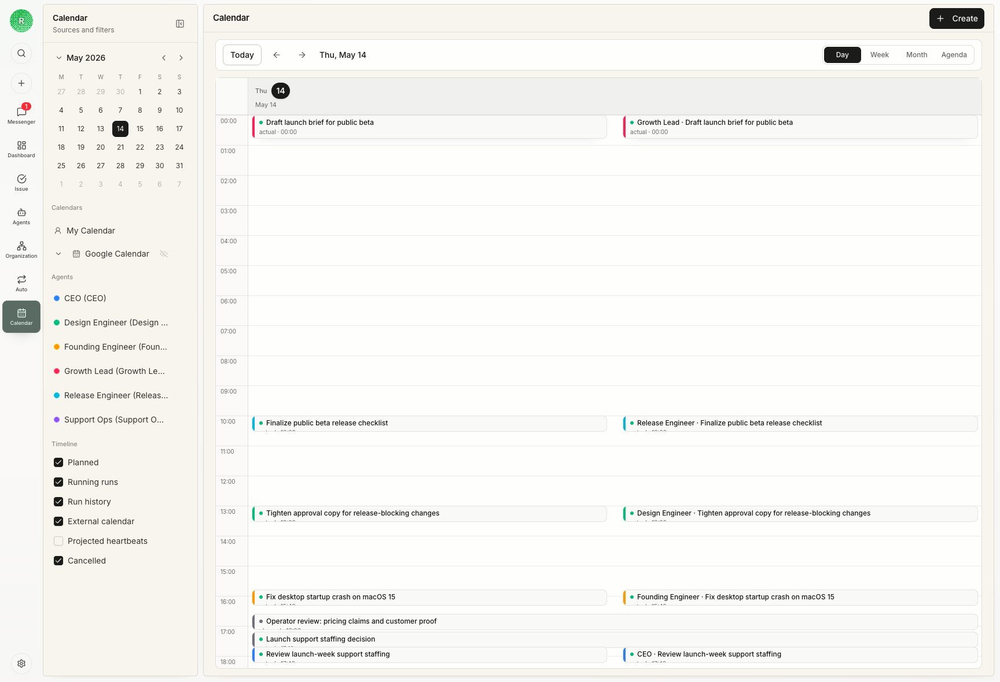

Calendar 用时间线显示工作实际发生在哪里。在 Rudder 里，它同时包含 agent runs、任务、人类检查点和外部日历块。

## 为什么 Calendar 重要

Agent 团队可能一直在跑，但忙不等于有效。Calendar 用来回答这些运营问题：

- 今天哪些 agent 在运行？
- 哪些任务真的被推进了？
- 执行后是否很快进入评审？
- 是否多个 agent 同时被阻塞？
- agent 运行是否集中在 launch、release 或 support 工作上？
- 人类检查点在哪里打断了工作，或解开了阻塞？

## Calendar 里会出现什么

Calendar 里会看到几类块：

| 类型 | 含义 |
| --- | --- |
| Agent run history | 关联 agent、任务和项目的实际 heartbeat runs |
| Human checkpoints | operator review、planning 或 decision blocks |
| Imported calendar events | 连接外部日历后的上下文 |
| Project and issue context | 回到持久工作记录的链接 |

有价值的 Calendar 数据来自真实任务和 run 记录。不要为了页面好看去造和工作无关的事件。

## 如何阅读

跑过几条任务后再看 Calendar。重点看：

- 是否所有时间都挤在一个项目上
- 实现后是否有 review block
- agent 输出和人类决策之间是否间隔太久
- 是否反复出现 blocked runs
- 是否有 agent 在没有关联任务的情况下运行

Calendar 最有用的地方是帮你做决定：重新分配、拆分工作、解除权限阻塞、安排评审，或者停掉低价值运行。

## Calendar 不是 assignment

创建 Calendar block 不会分配任务、改变优先级，也不会运行 heartbeat。分配和状态仍然在任务上。Calendar 解释时间，任务控制工作。

## 下一步

<CardGroup cols={2}>
  <Card title="任务生命周期指南" icon="route" href="/zh/how-to/issue-lifecycle">
    学习任务状态和评审选择如何影响工作历史。
  </Card>
  <Card title="Agents" icon="bot" href="/zh/concepts/agents">
    理解 Calendar 可以反映的 heartbeat runs。
  </Card>
</CardGroup>
