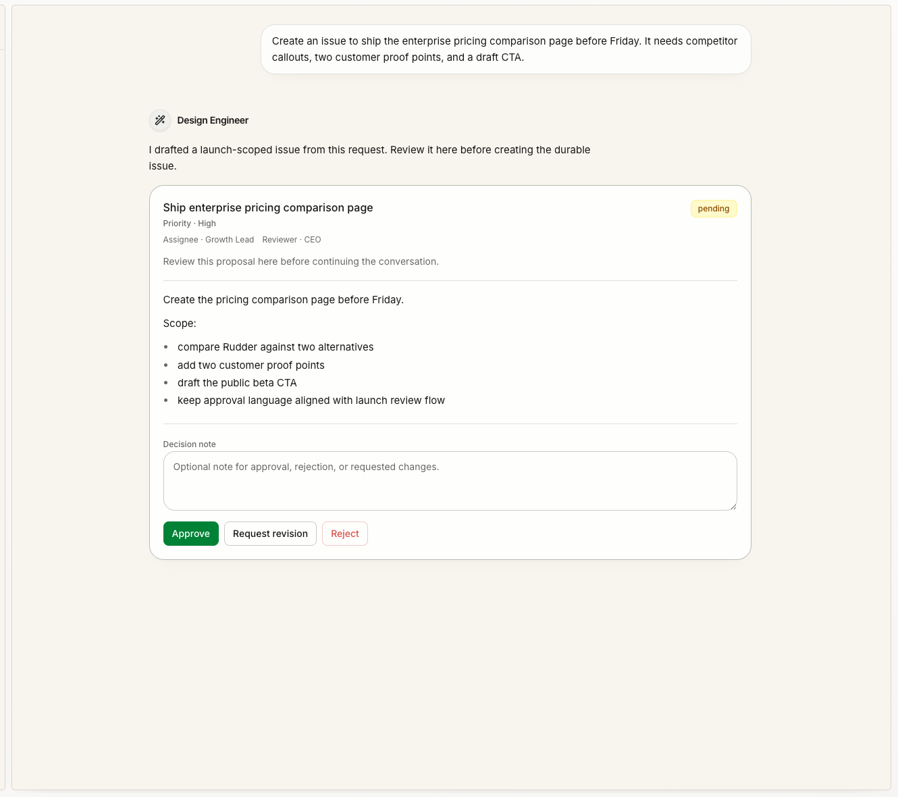

Chat 和 Messenger 是同一套沟通系统里的两个入口：Chat 把模糊意图变成可执行工作，Messenger 把人的注意力带回正确的线程、issue、run 或决策。

下一步还需要聊清楚时，用 Chat。工作已经开始、某件事需要人处理时，用 Messenger。

## 它们怎么配合

| 入口 | 用来做什么 | 下一步 |
| --- | --- | --- |
| Chat | 接收请求、澄清意图、补上下文、生成 issue 提案 | 请求变得可执行时，创建或更新 issue |
| Messenger | 回复、issue 线程、失败运行、阻塞、评审、预算提醒和决策 | 回到关联 issue、run 或线程，留下清楚下一步 |

边界很简单：Chat 让工作变清楚。Messenger 让进行中的工作不丢失人的注意力。

## 什么时候把 Chat 变成 issue

只要对话开始需要下面这些能力，就应该转成 issue：

- 一个 owner 执行下一步
- agent runtime 预算
- review 或 approval
- 失败或阻塞后的恢复位置
- 未来团队需要回看的持久历史

如果请求可以直接回答，而且没有后续工作，就留在 Chat。只要它变成需要分配、运行、评审或未来回看的工作，就创建 issue。

## Messenger 应该把你带回哪里

Messenger 回答一个很实际的问题：

> 现在什么需要我的注意，它属于哪个持久工作对象？

它应该把注意力信号变成下一步行动：

| 注意力信号 | 持久下一步 |
| --- | --- |
| Agent 提问 | 回复，并把决定留在 issue 上 |
| Run 失败 | 打开关联 issue 或 run，决定如何恢复 |
| 工作阻塞 | 写清楚缺少什么输入或 owner |
| 评审等待 | 接受、要求修改或标记 blocked |
| Chat 生成 issue 提案 | 接受、编辑或拒绝后再执行 |

Messenger 不应该变成第二套任务系统。如果一个线程产生了真实工作，下一步应该回到 issue。

## 反模式

不要把 Chat 或 Messenger 当成：

- 隐藏 backlog
- issue 状态的替代品
- 没有 owner 的长时间执行入口
- 评审决定的唯一记录
- 与 Rudder 工作对象脱节的通用聊天工具

## 下一步

<CardGroup cols={2}>
  <Card title="任务生命周期指南" icon="route" href="/zh/how-to/issue-lifecycle">
    学习什么时候可以分配、什么时候需要评审。
  </Card>
  <Card title="任务" icon="circle-check" href="/zh/concepts/issues">
    查看 Chat 和 Messenger 指向的持久执行对象。
  </Card>
</CardGroup>
