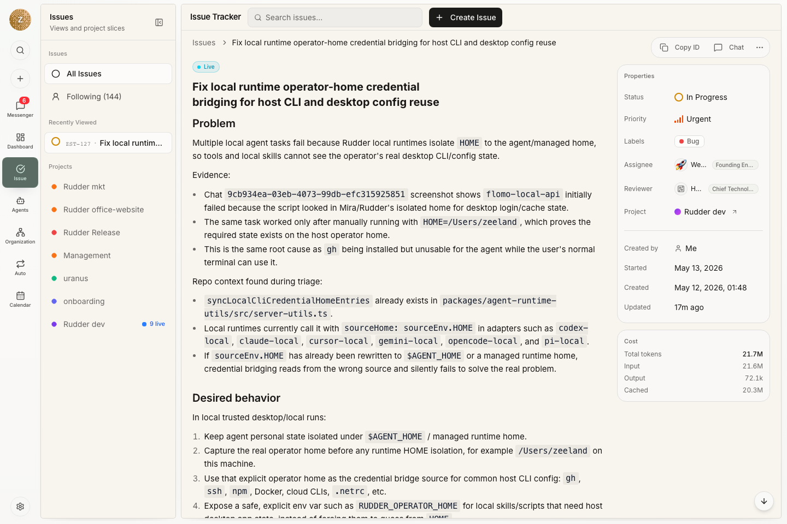

Rudder 里的每项工作都应该回答一个问题：为什么要做？

目标、项目和任务把这个答案留在执行现场。

## 什么时候用哪个对象

| 对象 | 适合用于... | 不适合用于... |
| --- | --- | --- |
| 目标 | 解释工作为什么重要 | 一次性实现 checklist |
| 项目 | 多个任务共享交付上下文、资源或工作区 | 一个很小的单点任务 |
| 任务 | 有人需要执行、评审或追踪一项工作 | 没有下一步动作的宽泛策略 |
| 子任务 | 一个任务需要多个 owner 或多个步骤 | 把无关工作藏在同一个父任务下 |

## 目标

目标表达方向。目标可以属于组织、团队、agent 或任务。它让工作不只是下一条 prompt。

目标应当用于结果，而不是每一个小任务。

## 项目

项目把相关执行放在一起。一个项目可以包含：

- 关联目标
- 负责人 agent
- 目标日期
- 附加资源
- 一个或多个项目工作区
- 执行工作区策略
- 预算上下文

当工作有持续范围、共享上下文或代码库时，使用项目。

## 任务

任务是持久工作单元。它支持：

- backlog、todo、in progress、in review、done、blocked、cancelled 等状态
- 优先级、assignee 和 reviewer
- 父任务和子任务
- 项目和目标链接
- 评论、活动、文档和附件
- 审批
- 执行工作区设置
- checkout 和当前执行锁

使用 `todo` 表示需求已经确定、下一步清楚、assignee 可以开始执行且不需要重新讨论产品判断。使用 `backlog` 表示问题值得保留，但范围、验收标准、优先级或负责人仍需讨论。

Reviewer 和 follow-up 让关闭过程可检查。Reviewer 判断实现质量；当前运行无法干净关闭时，follow-up 要写清剩下谁负责、还缺哪个决定、需要哪些证据。

## 为什么以任务为中心

聊天可以澄清请求，但任务保存归属、状态、历史、输出和评审上下文。Agent 从任务开始工作后，其他人以后可以直接检查任务，不需要重放整段对话。

只要 agent 会投入真实时间或预算，就应该使用这个模型。如果工作需要状态、owner、证据或评审，它应该先成为任务，再进入长时间运行。

## 下一步

<CardGroup cols={2}>
  <Card title="任务" icon="circle-check" href="/zh/concepts/issues">
    学习状态模型、checkout 语义和关闭信号。
  </Card>
  <Card title="Agents" icon="bot" href="/zh/concepts/agents">
    查看 assignee 如何通过 heartbeat 执行任务工作。
  </Card>
</CardGroup>
