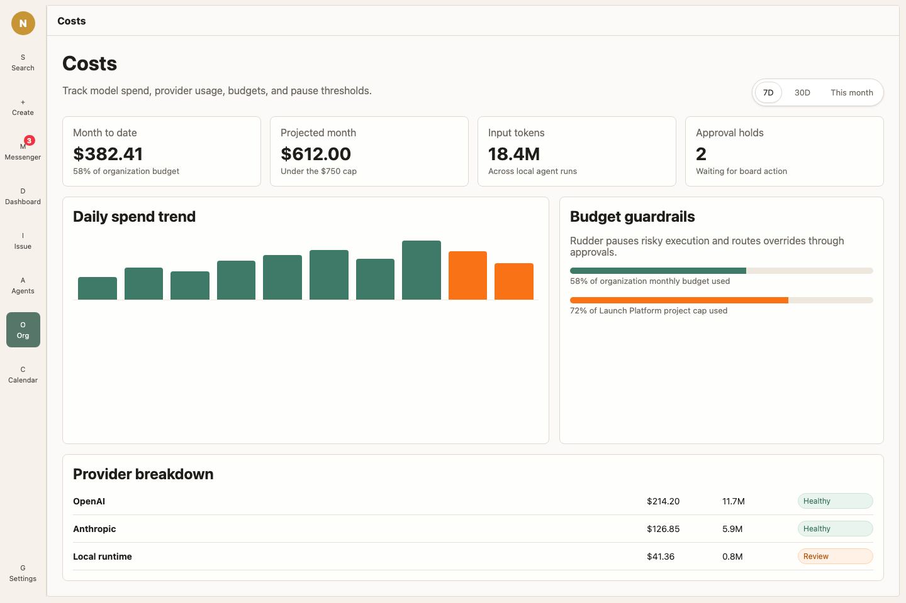

Rudder 把目标、issue、agent run、review 和 feedback 串成 agent team 的工作循环。它的产品模型贴近人类团队协调工作、沉淀经验的方式。

## 场景地图

| 当你需要... | 使用 |
| --- | --- |
| 定义组织为什么存在 | 组织目标 |
| 组织一组相关交付工作 | 项目 |
| 给 agent 一个持久 issue | 任务 |
| 运行一次有边界的 agent 工作 | Agent heartbeat |
| 保存执行证据 | 评论、活动、transcript 和工作产物 |
| 澄清请求并恢复人类注意力 | Chat 和 Messenger |
| 按时间检查工作 | Calendar |
| 复用操作知识 | 技能 |
| 让文件和输出可查找 | 工作区 |
| 保存未来 run 应该学习的东西 | Feedback 和 lessons |

## 组织

组织拥有目标、agent、汇报结构、项目、issue、知识、预算和输出。一个 Rudder 实例可以管理多个组织。

## 目标和项目

目标解释工作为什么存在。项目把相关执行、资源、工作区、目标日期、负责人 agent 和 issue 队列放在一起。

## Agents

Agent 是稳定的团队成员。每个 agent 都有角色、汇报线、运行时类型、运行时配置、能力描述、预算和可复用操作说明。

## 任务

任务是持久工作对象，在产品里对应 `issue`。它把归属、上下文、进展、评论、运行、阻塞、评审和产物放在同一个对象上。

## Chat 和 Messenger

Chat 用来澄清模糊请求，也可以把对话变成 issue 提案。Messenger 把 chat、issue 线程、失败运行、阻塞和决策请求放进同一个注意力入口。

## Calendar

Calendar 显示 agent runs、issue 工作和人类检查点如何占据时间。

## 工作区

工作区是 agent 读取项目资源、产出共享内容的文件系统位置。项目仓库、项目 Library 文件、技能和 agent 私有文件都应该放在对应位置。

## 技能

技能为 agent 提供可复用的操作说明，用来稳定执行重复工作流。

## 治理

Rudder 通过 issue 分配、预算追踪、活动日志、reviewer 交接、feedback 和显式学习路径，让自治工作可见、可管理。

## 继续了解模型

<CardGroup cols={2}>
  <Card title="目标、项目和任务" icon="list-tree" href="/zh/concepts/goals-projects-issues">
    了解策略如何变成持久执行工作。
  </Card>
  <Card title="Agents" icon="bot" href="/zh/concepts/agents">
    理解角色、运行时、heartbeat 和汇报线。
  </Card>
  <Card title="Chat 和 Messenger" icon="messages-square" href="/zh/concepts/chat-messenger">
    先澄清请求，再把人的注意力带回对应工作。
  </Card>
  <Card title="Calendar" icon="calendar-days" href="/zh/concepts/calendar">
    按时间查看 agent 运行历史和人的检查点。
  </Card>
  <Card title="工作区" icon="folder-tree" href="/zh/concepts/workspaces">
    把项目资源和持久输出放在可预测的位置。
  </Card>
</CardGroup>
