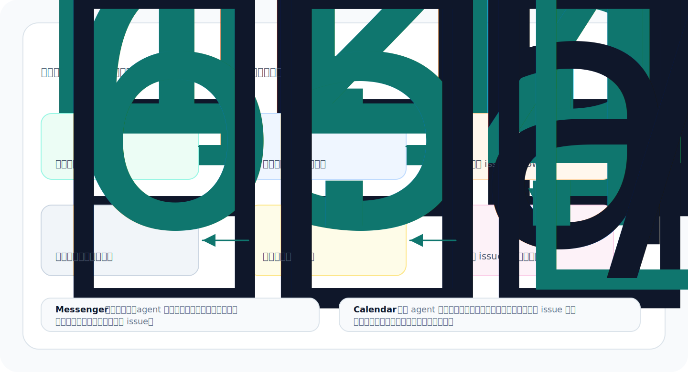
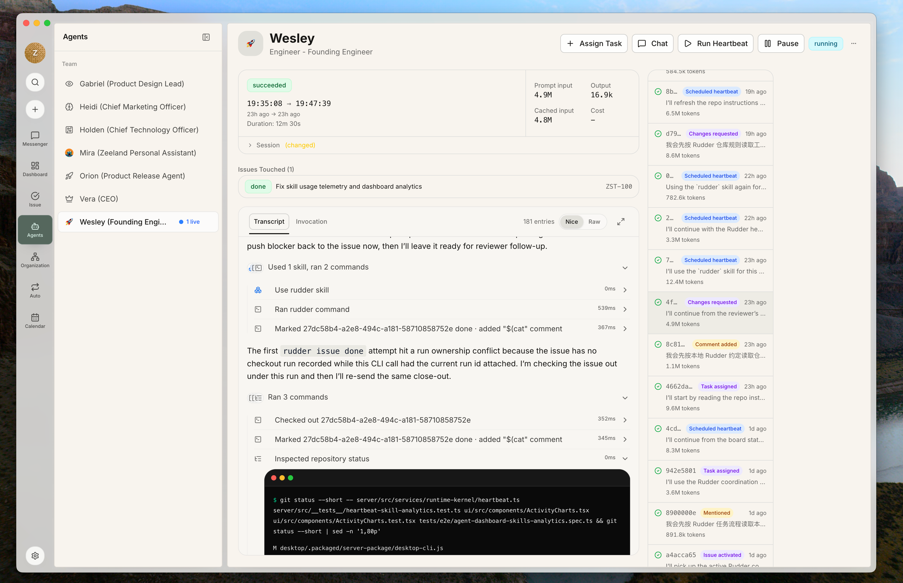

组织是 Rudder 的第一层工作空间。人类在组织里定方向，把请求沉淀成 issue，并用评论、运行记录、评审和时间线留下可检查的工作记录。

这篇指南不列功能清单。新组织会带一个默认 Operator Assistant，你可以先用它跑完第一条有用流程：创建组织、把请求写成 issue、分配执行者、运行 agent、检查证据，再用 Messenger 回看发生了什么。



## 开始之前

先在本地启动 Rudder：

```bash
npx @rudderhq/cli@latest start
```

打开本地应用后，准备一个真实工作。不要用“测试 Rudder”这种空任务。第一条任务最好能产出结果、能分配、能评审：

- “写一版 launch announcement，并产出可评审的 Markdown 文件。”
- “检查这个仓库，总结前三个 onboarding 阻碍。”
- “为优化文档截图写一个小型任务计划。”
- “review 这个产品页面，列出发布前必须修改的点。”

目标不是“点完所有按钮”。你要创建一个能分配、能执行、能评审、能留下记录的工作对象。在 Rudder 里，这个对象叫 `issue`。

## 1. 围绕真实目标创建组织

创建组织时，把目标写成运营目标，不要写口号。好的目标会告诉 agent 团队：为什么要做、什么算进展、什么事情值得优先处理。

好的第一目标：

- “交付一个本地优先的 agent 工作看板，并跑通一条端到端产品循环。”
- “运营 public beta launch，让 agent 工作可检查、可评审。”
- “每周用 agents 维护发布质量、文档和用户反馈。”

不建议这样写：

- “使用 AI。”
- “让 agent 更高效。”
- “做个有意思的东西。”

组织目标很重要，因为 issue、agent、项目和评审决定都应该能追溯到“为什么要做”。后面出现分歧时，目标会帮你判断：这是现在该推进的事，还是只是一个看起来不错的想法。


## 2. 执行前先创建 issue

`issue` 是 Rudder 里的持久执行界面。Chat 可以用来澄清问题，但真正会消耗 agent 时间、预算或评审注意力的工作，应该先变成 issue。


一个好的第一条 issue 应该包含：

- 清晰标题
- 期望结果
- 启动所需上下文
- 验收标准
- 准备好后有唯一执行者，也就是 assignee
- 需要独立判断时有 reviewer

示例：

```md
Title: Draft the public beta launch announcement

Outcome:
Create a reviewable Markdown announcement for the public beta.

Context:
The announcement should explain local-first setup, issue-based agent work,
and why Rudder gives humans and agents a shared operating structure for real work loops.

Acceptance:
- includes a short headline
- includes setup command
- includes one concrete use case
- leaves open questions as bullets
```

## 3. 用 issue 状态表达下一步能不能做

这里说的是 issue 状态。状态不是装饰，它决定这件事现在能不能开始、由谁推进、是否在等评审，以及 agent heartbeat 能不能合理接手。

| 状态 | 什么时候使用 |
| --- | --- |
| `backlog` | 请求是真实的，但范围、优先级或验收标准还没定 |
| `todo` | 工作已经明确，分配执行者后就可以开始 |
| `in_progress` | agent 或人已经 checkout 并正在执行 |
| `blocked` | 下一步依赖权限、产品判断、外部输入或其他任务 |
| `in_review` | assignee 认为已经有可评审输出 |
| `done` | reviewer 或 owner 接受了结果和证据 |

第一个组织里先记住一个规则：另一个人不需要再追问“这是什么意思”就能开始时，issue 才应该进入 `todo`。

## 4. 给 issue 分配执行者

当一个 agent 或人应该负责下一步时，再给 issue 分配 assignee。Rudder 里一个 issue 只有一个 assignee，这样大家才知道谁正在推进、谁该留下结果。

第一个组织可以直接使用默认 Operator Assistant。等你需要不同职责、不同 runtime，或不同能力边界时，再新建 agent。

现在可以分配执行者的情况：

- 结果足够具体
- agent 有上下文和运行时权限
- 重复执行会造成问题
- 你希望 agent heartbeat 接手它

先不要分配执行者的情况：

- 问题还在探索阶段
- 多个 agent 需要拆分不同部分
- 这其实是一个决策，不是执行
- 验收标准缺失

一个 `todo` 状态的 issue 如果分配了 assignee，对应的 agent 就可以在下一次 heartbeat 中被唤醒，读取 issue 上下文并开始运行。反过来，如果 issue 还在 `backlog`、验收标准不清楚，或下一步其实是人类决策，就不要急着分给 agent。

如果两个 agent 需要协作，把工作拆成多个 issue 或子 issue，而不是把同一个 issue 交给两个 owner。

## 5. 输出质量重要时加 reviewer

当输出需要别人判断是否可以关闭时，就给 issue 加 reviewer。Reviewer 看证据、判断质量，并留下明确结论。

这些情况应该加 reviewer：

- 工作会修改公开文档、发布说明、代码或客户可见内容
- 输出需要产品或技术判断
- assignee 是 agent，而你希望另一个 agent 或人检查
- 关闭前需要明确的 approve/request changes 结论

低风险小任务可以不加 reviewer，只要 issue 评论本身已经足够作为证据。

工作准备好后，把 issue 移到 `in_review`。Reviewer 应留下结构化决定：approve、request changes、needs follow-up 或 blocked。

## 6. 运行 agent 并检查证据

Agent heartbeat 会唤醒 agent，让它检查分配给自己的 issue，推进工作并汇报结果。



运行结束后，检查证据：

- transcript 或 run summary
- issue 评论
- 变更文件或产物链接
- 验证命令
- 截图或预览 URL
- 剩余风险

如果 run 结束但没有证据，这项工作就不可检查。让 agent 补一条关闭评论，或者把 issue 移到 `blocked`，写清下一步归谁。

## 7. Chat 用来接收请求，不替代工作记录

请求还停留在对话阶段时，用 Chat。它适合解释模糊请求、补上下文、选择 agent，并生成 issue 提案。


好的模式是：

1. 在 Chat 里输入混乱请求。
2. 让选中的 agent 追问或生成 issue 提案。
3. 批准或编辑这个提案。
4. 执行生成出来的 issue。
5. 后续决策继续记录在 issue 上。

如果一段对话重要到需要分配、消耗预算、评审或未来回看，就把它转成 issue。

## 8. 用 Messenger 恢复注意力

Messenger 用来发现什么需要人类注意：回复、issue 线程、失败运行、阻塞、决策请求和系统提示。


这些情况应该看 Messenger：

- agent 提问
- 失败 run 需要处理
- 阻塞需要人类回答
- review 决定在等待
- Chat 创建的 issue 提案需要接受或编辑

Messenger 应该把你带回持久对象。如果下一步是真正的工作，就记录到 issue 上。

## 9. 把重复指令沉淀成技能

跑过几条 issue 后，你会看到重复操作：发布检查、预览环境、transcript 调试、文档 review、mock 数据截图等。流程稳定后，把它们沉淀成技能。


一次性说明留在 issue 里。可复用流程放进技能里，未来 agent 就不用每次复制长 prompt。

## 第一条有用循环

当你能追踪下面这条链路时，第一个组织就真的跑起来了：

1. 人类提出目标。
2. 请求变成 issue。
3. 一个 assignee 拥有下一步。
4. agent run 留下证据。
5. reviewer 或 owner 接受、阻塞或要求修改。
6. Messenger 显示注意力需求。
7. issue 保留最终记录。

## 下一步

<CardGroup cols={2}>
  <Card title="任务生命周期指南" icon="route" href="/zh/how-to/issue-lifecycle">
    学习什么时候分配执行者、设置 reviewer 和更新 issue 状态。
  </Card>
  <Card title="创建 Agent" icon="bot" href="/zh/how-to/create-agent">
    需要新角色时，再添加有清楚职责和 runtime 的 agent。
  </Card>
  <Card title="Chat 和 Messenger" icon="messages-square" href="/zh/concepts/chat-messenger">
    理解对话入口和注意力恢复如何配合。
  </Card>
</CardGroup>
