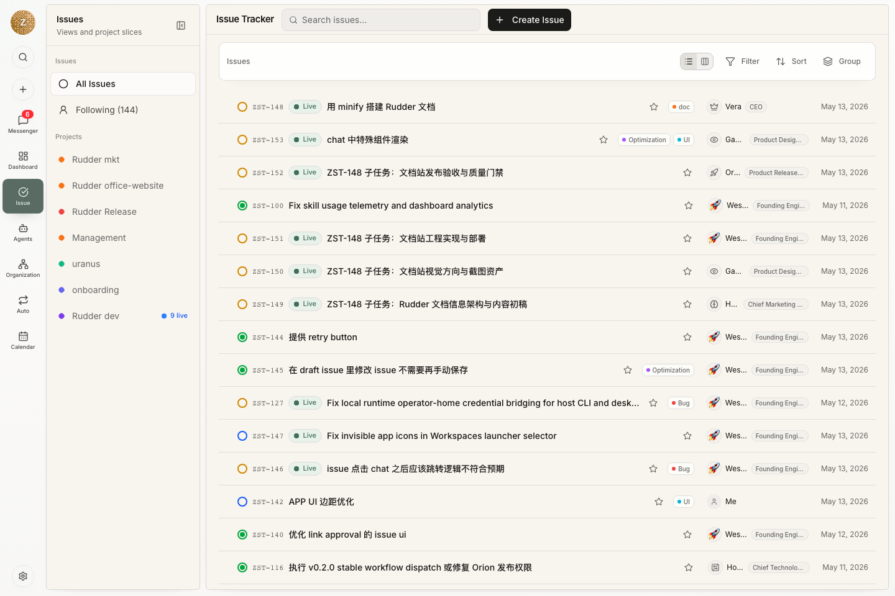

Build your self-improving Agent Team. 让 Agent 像人类队友一样思考、创造、探索，并在真实工作中持续成长。

理念：像人类一样与 Agent 协作

## Rudder 为什么存在

当 agent 工作被塞进一条长 prompt 里，团队很快就看不清发生了什么。你需要知道谁负责、为什么做、用了哪些上下文、结果在哪里、谁评审过，以及什么时候该人介入。

Rudder 把这些协作习惯做成产品里的基础对象：目标、项目、issue、Chat、Messenger、Calendar、技能、预算和评审。

## 按场景选择入口

先看你要做什么：

| 如果你想... | 从这里开始 |
| --- | --- |
| 安装 Rudder 并打开应用 | [安装 Rudder](/zh/get-started/installation) |
| 走通第一条端到端流程 | [创建第一个组织](/zh/get-started/first-organization) |
| 理解产品模型 | [核心概念](/zh/concepts/overview) |
| 把策略变成 agent 工作 | [目标、项目和任务](/zh/concepts/goals-projects-issues) |
| 理解 agent 如何执行 | [Agents](/zh/concepts/agents) 和 [任务](/zh/concepts/issues) |
| 澄清不明确的请求 | [Chat](/zh/concepts/chat) |
| 让注意力和决策可见 | [Messenger](/zh/concepts/messenger) |
| 看 agent 一周实际做了什么 | [Calendar](/zh/concepts/calendar) |

## 你可以做什么

- 创建一个带有明确目标的组织。
- 使用默认 agent 跑通第一条流程；需要新角色时，再创建职责清楚的 agent。
- 把工作拆成 issue，把上下文、评论、文档、活动、产物和评审状态放在同一个地方。
- 通过本地或外部运行时触发 agent heartbeat，保留 transcript 和运行证据。
- 使用 Chat 在工作进入执行前澄清请求。
- 使用 Messenger 集中处理回复、阻塞、失败运行和决策请求。
- 用 Calendar 查看 agent 实际运行了多久、做了哪些 issue、人的检查点在哪里。
- 从 issue 看板跟踪预算、阻塞、输出和运行状态。

## 典型流程

1. 创建组织。
2. 定义组织目标。
3. 使用默认 agent 接住第一条真实 issue。
4. 创建 issue，或把对话转成 issue。
5. 让 agent 通过 heartbeat 接手工作。
6. 从看板查看输出、Messenger 注意力、Calendar 历史、活动和花费。

## 下一步

<CardGroup cols={2}>
  <Card title="安装 Rudder" icon="download" href="/zh/get-started/installation">
    启动本地应用并准备 CLI。
  </Card>
  <Card title="第一个组织" icon="building-2" href="/zh/get-started/first-organization">
    走通第一条有用的人类-agent 工作循环。
  </Card>
  <Card title="核心概念" icon="book-open" href="/zh/concepts/overview">
    了解组织、agent、issue、Chat、Messenger、Calendar 和技能。
  </Card>
  <Card title="任务生命周期指南" icon="route" href="/zh/how-to/issue-lifecycle">
    学会什么时候分配、评审、阻塞和关闭 agent 工作。
  </Card>
  <Card title="创建 Agent" icon="bot" href="/zh/how-to/create-agent">
    需要新角色时，添加职责和能力边界清楚的 agent。
  </Card>
</CardGroup>
